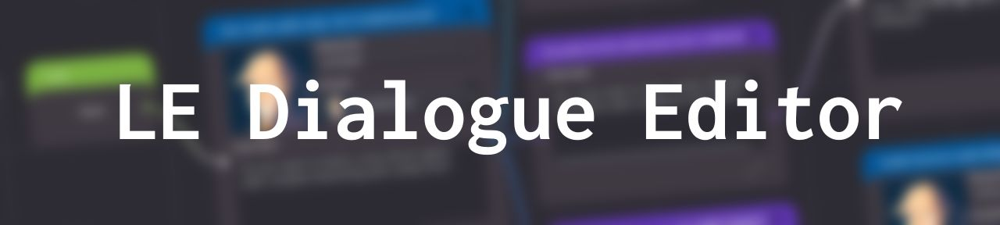

*LE Dialogue Editor* is a standalone application, made with the [Godot Engine](https://godotengine.org/), created with the main purpose to manage tiny but complex dialogues.

Learn more in the [WIKI](https://github.com/Levrault/levrault-dialogue-editor/wiki)

## Can this application be useful for you?

If you want to create a **visual novel** or a **story-driven game with non-linear story**, this application **shouldn't** be your first choice. Why? Because managing heavy dialogue in a tree view will be simply too hard to maintain.  That why you should those applications instead

- [Dialogic](https://github.com/coppolaemilio/dialogic) a plug-in for Godot Engine by Emilio Coppola
- [Twinejs](https://github.com/klembot/twinejs) a port of Twine
- [Renpy](https://www.renpy.org/) a visual novel engine
- [Visual Novel Maker](http://visualnovelmaker.com/) a visual novel engine

But if you want to create small conversations between multiples characters, LE Dialogue Editor should do the job. It support

- Localization
- Character name and portrait
- Choices
- Conditional branching for both dialogue and choices
- Preview of the dialogue based on the condition
- Emitting custom signals at certain dialogue
- Editing multiple JSON files at once

## Credits

- Icons : https://feathericons.com/
- uuid : https://github.com/binogure-studio/godot-uuid/blob/master/uuid.gd

